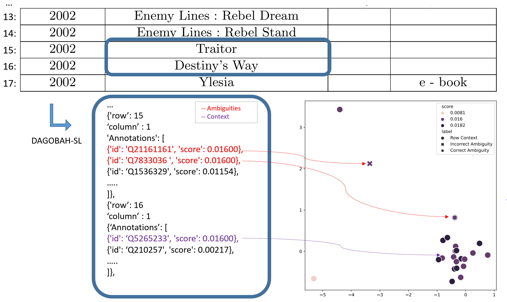

# Radar Station: Using KG Embeddings for Semantic Table Interpretation and Entity Disambiguation

Radar Station is cell-entity disambiguation tool for the domain semantic table interpretation (STI). It leverages graph embeddings to optimize the result of a given previous cell-entity annotation system.


<!-- toc -->

- [Overview](#overview)
- [Requirements](#requirements)
- [Quick Start](#Quick-Start)
- [Parameters](#Parameters)
- [Folder Structure](#Folder-Structure)

<!-- tocstop -->

## Overview
Numerous approaches have been proposed for handling these issues.
Among these methods, heuristic-based iterative approaches aim to leverage the column types and the inter-column relationships aggregated by voting strategies for disambiguating cell annotations.
Heuristic-based iterative approache have been demonstrated to be the methods reaching the best performance on venues like [SemTab challenge](https://www.cs.ox.ac.uk/isg/challenges/sem-tab/).
However, one drawback of current strategies is related to error propagation as if the type (respectively the relation) annotation is incorrect. Often such systems propagate the entity annotation error in the target column.
Another limitation of these approaches is that they often ignore other column-wised semantic similarities, for example, that books appearing in the same column may share the same topic. 

To address these two limitations, we present Radar Station that takes advantage of both an iterative disambiguation pipeline and semantic disambiguation using graph embedding similarities. 
Radar Station takes as input cell-entity annotations and associated confidence scores that quantify the level of certainty associated with each result. 
This approach then uses an ambiguity detection module that detects cases where the cell annotation is potentially wrong due to the error propagation.
In the following steps, the use of graph embeddings allows Radar Station potentially fix the wrong annotations by taking into account semantic proximities (e.g. geometric proximity of entities representing books) that are not directly encoded and capturable from the contents of table columns.



## Requirements
The data needed for running Radar Station include the embeddings, the scores generated by a heuristic annotation system, and the target column index for the disambiguation. The evaluation further needs the ground truth data.

Radar Station is written in Python (version 3.7.9 or later)

All computations are performed on the CPU. Therefore a large number of cores is advisable. No GPU is necessary.

To setup the environment for Radar Station, run:

```
pip install -r requirements.txt
```

## Quick Start

To run Radar Station on Limaye dataset using RotatE with the tolerance of the ambiguity selection equals to 1:
 
```
python run.py --data_path=[the root folder of the dataset] --output_path=[your output file] --tolerance=1 --scoreSystem=DAGOBAHSL --dataset=Limaye --model=RotatE --evaluation
```

## Parameters

- data_path: data folder for the candidate scores, embeddings, and ground truth. These data should show be downloaded with the following link.
- output_path: the output folder for Radar Station disambiguation algorithm
- tolerance: the tolerance t for the ambiguity selection, 0<=t<=1
- scoreSystem: the input scoring system, please choose between MTab, DAGOBAHSL and bbw.
- dataset: the target dataset which aims to be interpreted. Please choose between T2D, Limaye, 2T, and ShortTable
- model: the target graph embeddings model for enabling the disambiguation, choose between RotatE, DistMult, TransE, and ComplEx
- evaluation: Whether or not to evaluate the output

## Folder Structure

```
│  readme.md 
│  requirements.txt
│  run.py
│  __init__.py
├─radarStation
│  │  embedding_loader.py
│  │  scoring_loader.py
│  │  radar_station.py
│  │  evaluation.py
│  │  __init__.py
```

Where these files include following functionalities:

- run.py: The python user interface to run Radar Station
- embedding_loader.py: Take a Qid as the input and extract an embedding for this entity. 
- radar_station.py: The core of the Radar Station disambiguation method. See paper ''Radar Station: Using KG Embeddings for Semantic Table Interpretation and Entity Disambiguation'' for more details.
- scoring_loader.py : loading the scoring for the systems: DAGOBAHSL, MTab, BBW
- evaluation.py: the evaluation module for the result. 

## Supplemental Material Statement.
The RotatE Embeddings, TransE embeddings, DAGOBAH-SL scores, Ground Truth and other required datasets are available from [Zenodo](https://zenodo.org/record/6522985\#.YnSoEN9BwuU) while the ComplEx and DistMult embeddings are available from [Zenodo](https://zenodo.org/record/6522921\#.YnSoMN9BwuU).
One could generate the Mtab and BBW scores with scripts from the folder baselines and put them into the folder /BaselineScoring/BBW_Scoring/ of the data folder.

## License

[BSD-3-Clause](LICENSE.txt).

## Citation

To cite this work please use:

```
@inproceedings{radarstation,
  title={{Radar Station: Using KG Embeddings for Semantic Table Interpretation and Entity Disambiguation}},
  author={Liu, Jixiong and Huynh, Viet-Phi and Chabot and Troncy, Rapha{\"e}l},
  booktitle={21$^{st}$  International Semantic Web Conference (ISWC)},
  year={2022}
}
```


## Maintainer

* [Jixiong LIU](mailto:jixiong.liu@orange.com)
* [Yoan CHABOT](mailto:yoan.chabot@orange.com)
* [Raphaël TRONCY](mailto:raphael.troncy@eurecom.fr)


